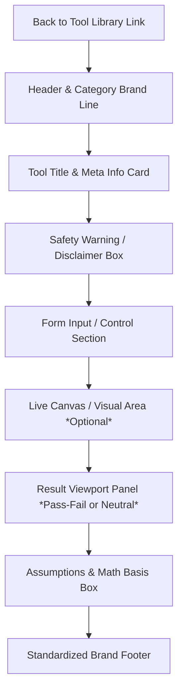

# ToolHub Design System & Development Guide

This document defines the standardized visual guidelines, UI/UX architecture, and implementation standards for all tools in the ToolHub library. By following this template, developers can ensure that every new utility achieves a premium, cohesive, and professional aesthetic aligned with the **Level3Support** brand.

---

## 🎨 CSS Architecture: Tiered & Layered Approach

To prevent bloated global stylesheets, eliminate inline styling, and guarantee zero layout side effects, ToolHub uses a tiered CSS architecture structured around modern CSS Cascade Layers (`@layer`):

1. **Brand Core (`css/core.css`)** [Layer: `core`]:
   * Holds central variables & design tokens (colors, typography, spacing).
   * Defines global resets (`*`, `body`), basic elements, and standard branding headers, footers, and page wrappers.
2. **Standard Components (`css/components.css`)** [Layer: `components`]:
   * Contains reusable widgets (forms, grid rows, inputs, buttons, modals, and messaging cards).
   * Contains standard layout utilities and micro-animations.
3. **Tool-Specific Styles (`css/[tool-name].css` or inline `<style>`)** [Un-layered]:
   * Local overrides and styling specific *only* to a single tool.
   * **Rule of Cascade:** Because `core` and `components` are layered, any local page styles will automatically take priority over central defaults without needing `!important`.

All HTML files link both styles in sequence:
```html
<link rel="stylesheet" href="css/core.css?v=1" />
<link rel="stylesheet" href="css/components.css?v=1" />
```

### 1. Typography & Hierarchy
*   **Brand Typeface:** `'Outfit', sans-serif` (used for main titles, section headers, and high-impact metadata).
*   **UI/Reading Typeface:** `system-ui, -apple-system, sans-serif` (used for input labels, body text, form elements, and detailed reports).
*   **Hierarchy Standard:**
    *   Main Tool Header: `1.8rem` (Outfit, bold, text-align left)
    *   Form & Card Section Titles: `1.15rem` to `1.25rem` (Outfit, bold)
    *   Labels & Field Notes: `0.85rem` to `0.95rem` (Regular UI sans)

### 2. Category Color Identity System
Each tool category has a distinct identity with dedicated, premium color badges and borders. The colors are defined dynamically in `core.css`:

| Category | CSS Variable | Hex Color | Usage & Identity Badge |
| :--- | :--- | :--- | :--- |
| **Calculators** | `--color-calculators` | `#3b82f6` | 🔋 `background: #eff6ff; color: #3b82f6;` |
| **Grid & Controls** | `--color-scada-diagnostics` | `#8b5cf6` | 🌐 `background: #f5f3ff; color: #8b5cf6;` |
| **PV Field Tools** | `--color-pv-field-tools` | `#f59e0b` | ☀️ `background: #fffbeb; color: #f59e0b;` |
| **BESS Field Tools** | `--color-bess-field-tools` | `#10b981` | 🔋 `background: #ecfdf5; color: #10b981;` |
| **HSE & Safety** | `--color-hse` | `#ef4444` | ⚠️ `background: #fef2f2; color: #ef4444;` |

---

## 📐 Unified Tool Layout & Structure

Every tool file must follow a strict vertical order to ensure complete consistency across desktop and mobile devices. Below are the key structure modules:



### 1. Navigation & Brand Header
*   **Back Link:** A clean back-arrow linking back to `index.html#tools`.
*   **Brand Header:** Includes the central Level3Support header logo and a floating text-badge showcasing the category in caps (e.g., `⚡ BESS CALCULATOR` or `⚡ GRID & CONTROLS`).

### 2. Tool Title Card (`.tool-header-section`)
A white box with light borders displaying the tool title, a brief one-line value proposition description, and a meta row showing:
*   Category tag matching the identity system.
*   System status badge (`Active` [Green], `Under Review` [Amber], `In Progress` [Brown]).

### 3. Safety Disclaimer Box (`.warning-box`)
A colored notification box detailing the limitations of the tool.
*   Must utilize FontAwesome exclamation icon (`<i class="fas fa-exclamation-triangle"></i>`).
*   Title styled with `.warning-title`.

### 4. Input & Control Section (`.form-section`)
Form inputs are systematically organized in grids to support responsive layouts:
*   **Double-Column Rows:** `<div class="input-row">` for two equal-width fields.
*   **Triple-Column Rows:** `<div class="input-row-3">` for compact three-column layouts.
*   **Integrated Units:** Input fields requiring units must use the `.input-with-unit` helper block to neatly attach the unit badge (e.g., `V`, `A`, `%`, `kW`) to the right edge of the input.
*   **Validation Errors:** A hidden `.validation-error` block located right above the button row to show custom validation text when calculations encounter input bounds violations.

### 5. Results Panel (`.result-panel`)
There are two distinct result presentation modes:
1.  **Pass/Fail Verification Viewports (`.result-panel` [Default Green]):**
    Ideal for sizing calculators (e.g., BESS Cable Sizer). It is colored light green (`background: #f0fdf4`) and designed to incorporate validation badges (`Acceptable`, `Warning`, `Failure`).
2.  **Neutral / General Informational Viewports (`.result-panel.neutral` [Slate]):**
    Ideal for solvers, converters, or simulator calculations (e.g., Power Triangle). Uses a modern neutral aesthetic (`background: #f8fafc`) without pass/fail indicators.

### 6. Assumptions & Sizing Logic Box (`.assumptions-box`)
A standardized premium light-blue card (`.assumptions-box`) featuring an electric-blue left border, placed at the base of the inputs to detail the calculations, mathematical formulas, and scientific standards utilized behind the scenes. Excellent for transparency and engineering reference.

### 7. Brand Footer (`.footer`)
Every page wraps up with a high-fidelity dark footer (`background: #0f172a`) that lists:
*   Copyright notice.
*   "Powered by aprovero" logo with interactive hover transparency.

---

## 🧼 Resolved Structural Incongruences

To enforce consistency, the following visual differences between old designs and new tools have been standardized:

1.  **Elimination of Inline Results Panel Styles:** Previously, neutral tools used complex inline styles on the `.result-panel` to override its default green theme. We have introduced `.result-panel.neutral` into the core stylesheet so that all neutral results panels look completely uniform without needing inline code.
2.  **Strict Button Alignment:** Button rows (`.btn-row`) must consistently use modern grid gaps instead of float alignments, ensuring perfect stacking order on mobile viewports.
3.  **Form Sizing Integrity:** Input heights and select menu heights are standardized to `42px` to prevent mismatched row alignments when input columns contain a mix of select elements and text boxes.

---

## 📋 Copy-Paste Boilerplate Template

Use this HTML boilerplate as the base template for any new tool created inside Level3Support:

```html
<!DOCTYPE html>
<html lang="en">
<head>
  <meta charset="UTF-8">
  <meta name="viewport" content="width=device-width, initial-scale=1.0">
  <title>Tool Title — Level3Support</title>
  <link rel="stylesheet" href="css/core.css?v=1" />
  <link rel="stylesheet" href="css/components.css?v=1" />
  <!-- Link tool-specific CSS immediately after core/components if needed -->
  <!-- <link rel="stylesheet" href="css/tool-name.css" /> -->
  <link href="https://cdnjs.cloudflare.com/ajax/libs/font-awesome/6.0.0/css/all.min.css" rel="stylesheet">
</head>
<body>
  <div class="placeholder-container">
    <!-- Back to Library Link -->
    <a href="index.html#tools" class="back-link"><i class="fas fa-arrow-left"></i> Back to Tool Library</a>

    <!-- Header Panel -->
    <div class="header" style="border-bottom: 1px solid var(--border-color); padding-bottom: 16px; margin-bottom: 16px;">
      <div class="logo">
        
      </div>
      <div style="font-size: 0.75rem; font-weight: 600; color: var(--text-secondary); background: var(--background-dark); padding: 4px 8px; border-radius: 4px;">
        ⚡ CATEGORY_LABEL
      </div>
    </div>

    <!-- Title Section -->
    <div class="tool-header-section">
      <div class="tool-title-row">
        <div>
          <h1 style="text-align:left; margin:0; font-size:1.8rem; font-family:'Outfit',sans-serif;">
            Tool Title
          </h1>
          <p style="color:var(--text-secondary); margin-top:0.5rem; font-size:1rem;">
            A high-performance premium description of what this beautiful utility computes.
          </p>
        </div>
        <div class="tool-meta">
          <span class="tile-category" style="background:#eff6ff; color:#3b82f6; padding:4px 8px; border-radius:4px; font-size:0.75rem; font-weight:600; text-transform:uppercase;">🔋 Category</span>
          <span class="status-badge" style="background:#dcfce7; color:#15803d; padding:4px 8px; border-radius:4px; font-size:0.75rem; font-weight:600; text-transform:uppercase;">Active</span>
        </div>
      </div>
    </div>

    <!-- Disclaimer Ribbon -->
    <div class="warning-box" style="margin-top: 0; margin-bottom: 24px;">
      <i class="fas fa-exclamation-triangle"></i>
      <div>
        <div class="warning-title">Safety Disclaimer</div>
        This ToolHub assists field engineers but does not replace approved project documents, local electrical codes, manufacturer manuals, or site-specific HSE procedures.
      </div>
    </div>

    <!-- Form Section -->
    <div class="form-section" style="padding: 20px; background: #ffffff; border: 1px solid var(--border-color); border-radius: var(--border-radius-md);">
      <div class="input-row">
        <div class="input-group">
          <label for="param-one">Parameter One <span class="required">*</span></label>
          <div class="input-with-unit">
            <input type="number" id="param-one" placeholder="e.g. 100" required>
            <div class="input-unit">kW</div>
          </div>
        </div>
        <div class="input-group">
          <label for="param-two">Parameter Two</label>
          <select id="param-two" style="width: 100%; height: 42px;">
            <option value="option-a">Option A</option>
            <option value="option-b">Option B</option>
          </select>
        </div>
      </div>

      <!-- Action Buttons -->
      <div class="btn-row" style="display: grid; grid-template-columns: 1fr 1fr; gap: 16px; margin-top: 20px;">
        <button id="reset-btn" class="button-secondary"><i class="fas fa-undo"></i> Reset</button>
        <button id="calculate-btn"><i class="fas fa-calculator"></i> Calculate</button>
      </div>
    </div>

    <!-- Results Panel (Neutral Variant Example) -->
    <div id="result-panel" class="result-panel neutral" style="display: none; margin-top: 24px;">
      <div class="result-header">
        <span>Calculation Results</span>
      </div>
      <div class="result-row">
        <span>Computed Output:</span>
        <span id="res-val" style="font-weight: 700;">--</span>
      </div>
    </div>

    <!-- Assumptions / Engineering Logic Card -->
    <div class="assumptions-box" style="margin-top: 24px;">
      <div class="assumptions-title"><i class="fas fa-info-circle"></i> Sizing Logic & Formulas</div>
      <ul class="assumptions-list">
        <li>Formula description or physics law here.</li>
      </ul>
    </div>
  </div>

  <!-- Standardized Brand Footer -->
  <footer class="footer">
    <div class="footer-text">
      <div class="footer-copyright">© 2026 LEVEL3SUPPORT. ALL RIGHTS RESERVED.</div>
    </div>
    <div class="footer-logo">
      <span style="font-style: italic; opacity: 0.85; font-size: 0.85rem; color: var(--text-light);">Powered by</span>
      
    </div>
  </footer>

  <script src="js/common.js"></script>
  <script>
    // Embedded page control logic
  </script>
</body>
</html>
```
